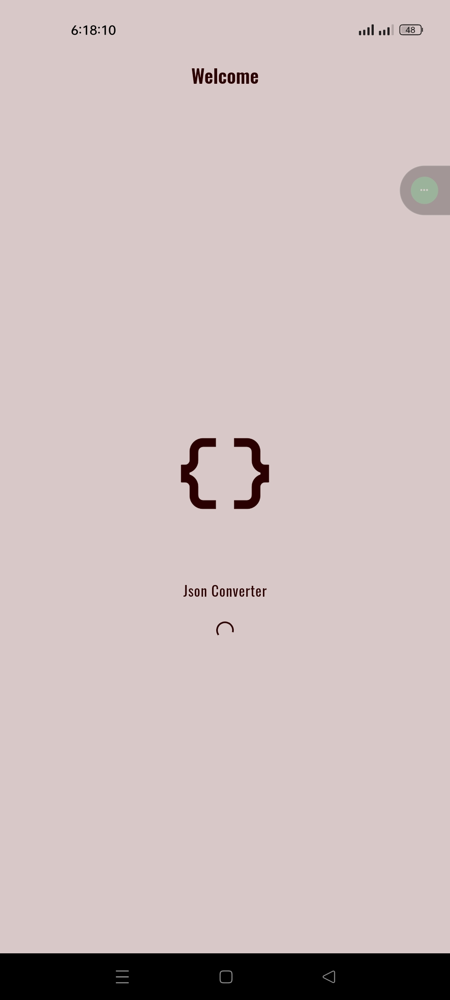
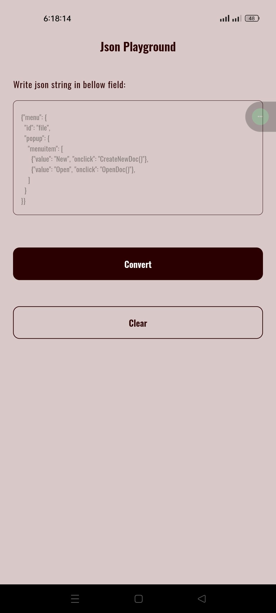
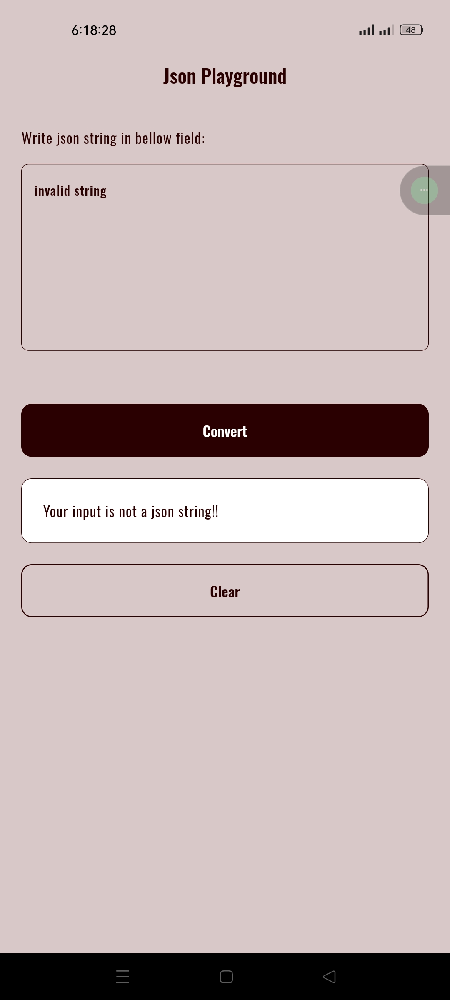
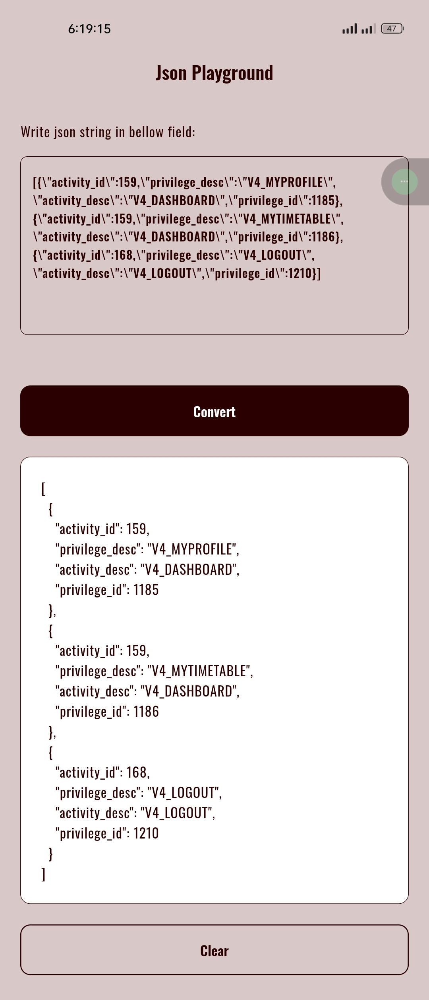
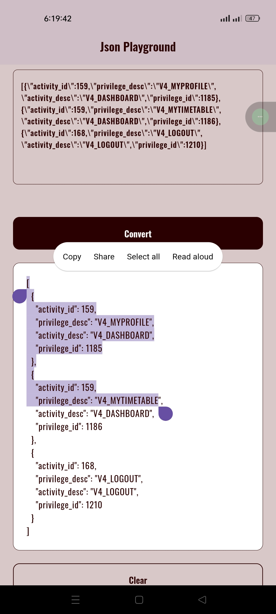
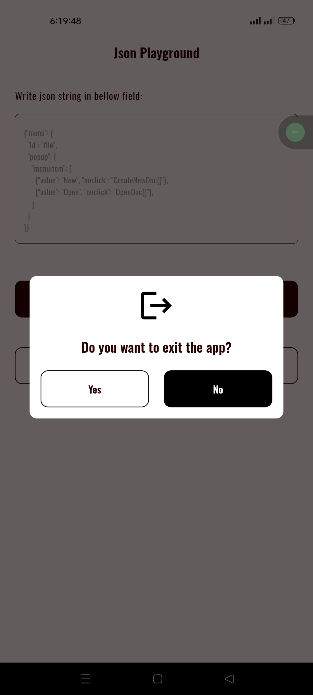

# Json Converter

A simple flutter app that convert json-string to json

## Tools and Technologies:

1. Flutter framework.
2. Dart programming language.

## Description:

You need to give input json-string in the text field. If you give correct input you will get json or
app will show error message. you can also clear the result and text field using a button by a single
tap. After getting the result you can copy it by tapping long on the result text.

## Screenshots:

  
  
  
  
  
  
